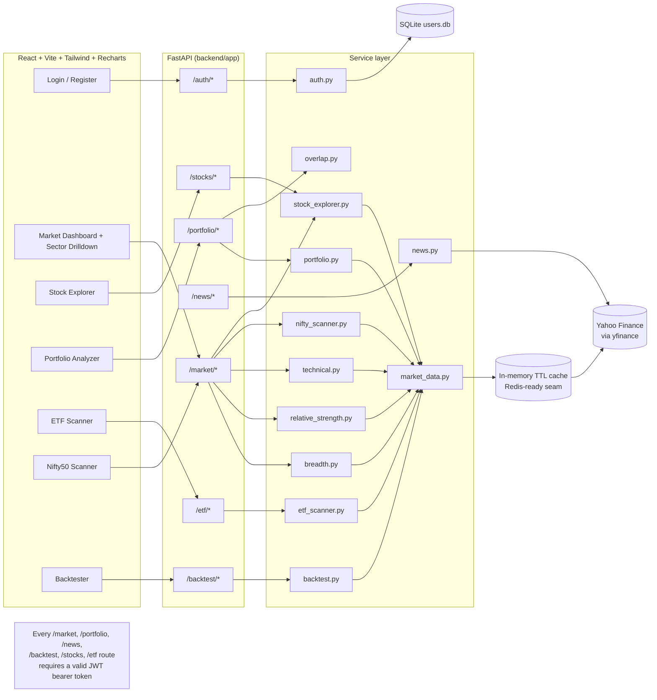

# Market Intelligence Platform

A full-stack financial analytics platform for the Nifty 50: market breadth,
relative-strength ranking, portfolio risk metrics (XIRR/CAGR/Sharpe/Sortino/
Beta/Max Drawdown), ETF look-through overlap, news sentiment, a
moving-average-crossover backtester, an any-ticker stock explorer, a ported
ETF dip-buying scanner, and a Nifty 50 multi-timeframe technical scanner --
all computed live from Yahoo Finance data, behind real JWT-based login, no
mocked numbers.

This project generalizes the indicator/scanner logic already proven out in
this repo's `stock/` folder -- `stock/ETF/etf_scanner.py`,
`stock/Nifty50/nifty50_bot.py`, `stock/Silver/silver_buying.py`'s
volume-spike heuristic, and the "enter any stock, get an analysis" intent
behind `stock/stock_analyzer.py` / `stock/ai_stock_analyser.py` -- into a
proper service-oriented backend with a real, authenticated frontend, instead
of single-file scripts with dummy data and hardcoded API keys.

## Why this exists

Stock/ETF screeners are common portfolio projects. What differentiates this
one -- and what a technical interviewer will actually probe -- is the
**engineering**, not the finance: a clean service-layer architecture, a
caching seam that's explicitly Redis-ready, a dependency-light XIRR solver
written from scratch instead of imported, real JWT auth over a SQLite user
store, and metrics computed on real fetched data end-to-end (verified against
live Yahoo Finance data while building this, not just unit-tested against
fixtures).

## Architecture



## Feature modules

| Module | What it computes | File |
|---|---|---|
| Auth | Register/login, PBKDF2-HMAC password hashing over SQLite, JWT bearer tokens gating every other route | `app/auth.py` |
| Sector Heatmap + Drilldown | 1D % change per Nifty 50 stock by sector; clicking a sector fetches full fundamentals+technicals+chart per stock in it | `services/breadth.py`, `/market/sector/{sector}/stocks` |
| Market Breadth | Advance/decline ratio, % above 50/200 DMA, regime (Bullish/Bearish/Sideways) | `services/breadth.py` |
| Relative Strength | Stock excess return vs Nifty over a rolling window, percentile-ranked (0-99, IBD-style) | `services/relative_strength.py` |
| Stock Explorer | Enter any ticker/company name -> price, day/52w range, volume, market cap, P/E, P/B, ROE, revenue, margins, dividend yield, analyst view+target, full technical readout, 6M chart | `services/stock_explorer.py` |
| Technical Scanner | RSI, EMA20/50/200, MACD, Bollinger Bands, Stochastic, pivot support/resistance, volume-anomaly ("whale") flag, rule-based verdict | `services/technical.py` |
| ETF Scanner | Ported from `stock/ETF/etf_scanner.py`: RSI/EMA/VWAP-scored dip-buying strategy across liquid Indian ETFs, category-diversified pick + full scan table | `services/etf_scanner.py` |
| Nifty50 Multi-Timeframe Scanner | Ported from `stock/Nifty50/nifty50_bot.py`: 1m/5m/10m/15m/1h/1d verdicts voting across 5 EMAs + RSI/MACD/Stochastic | `services/nifty_scanner.py` |
| Portfolio Analyzer | XIRR (bisection solver), CAGR, Sharpe, Sortino, Max Drawdown, Beta vs Nifty, annualized volatility | `services/portfolio.py` |
| ETF Overlap | Look-through exposure per underlying stock across direct holdings + ETF holdings | `services/overlap.py` |
| News Sentiment | Yahoo Finance headlines + finance-lexicon sentiment scoring (Positive/Negative/Neutral, impact score) | `services/news.py` |
| Backtester | SMA crossover strategy vs buy-and-hold: CAGR, Sharpe, Max Drawdown, win rate, equity curve | `services/backtest.py` |

## Tech stack

- **Backend:** Python, FastAPI, Pydantic, pandas/numpy for the quant math, `yfinance` as the data source, PyJWT for auth tokens.
- **Auth:** SQLite user store (`backend/data_store/app.db`, gitignored), PBKDF2-HMAC-SHA256 password hashing (200k iterations, no bcrypt dependency), JWT bearer tokens (7-day expiry, `HS256`).
- **Caching:** process-local TTL cache (`app/cache.py`) with the exact `get/set(ttl)` interface a Redis client needs -- swapping in Redis for a multi-instance deployment touches one file. A `_download_with_retry` wrapper around every `yf.download` call absorbs Yahoo's occasional transient failures.
- **Frontend:** React + Vite, Tailwind CSS, Recharts for line charts, a hand-rolled CSS-grid heatmap and sparkline (no charting-lib dependency for those).
- **Data source:** Yahoo Finance (`yfinance`), batched multi-ticker downloads to keep the Nifty 50-wide breadth/RS scans to a handful of HTTP round trips instead of 50.

## Running it

```bash
# Backend
cd backend
pip install -r requirements.txt
uvicorn app.main:app --reload --port 8123

# Frontend (separate terminal)
cd frontend
npm install
npm run dev   # http://localhost:5173, talks to http://127.0.0.1:8123
```

Open the app and register a new account (any username/password -- it's your
own local SQLite instance, no external service involved) to log in. No API
keys or secrets are required to run this -- news sentiment uses a local
lexicon, not an LLM API, specifically so the demo works out of the box.

## Known approximations (be ready to discuss these in an interview)

- **Nifty 50 constituent list** (`app/data/nifty50.py`) is a static snapshot. NSE reshuffles the index twice a year (and corporate actions like demergers can invalidate a ticker entirely -- Tata Motors' 2025 demerger did exactly this); there's no free API for current constituents, so this needs manual refresh.
- **ETF holdings snapshot** (`app/services/overlap.py`) is illustrative, not live -- real-time ETF constituent weights aren't available without a paid data vendor or scraping AMC factsheets.
- **News sentiment** is a lexicon scorer, not an LLM. It's fast and dependency-free, which is the right trade for a live demo; the Phase 2 section below is the honest upgrade path.
- **XIRR** uses bisection on the NPV function rather than a library like `scipy.optimize.brentq`, to keep the backend dependency-light.
- **Auth** is intentionally minimal (SQLite + PBKDF2 + JWT, no refresh tokens/roles/rate-limiting) -- enough to gate a demo behind real login without pulling in a full auth framework.
- **Yahoo Finance is occasionally flaky under load** (malformed responses, transient `TypeError`s inside `yfinance` itself) -- `market_data._download_with_retry` retries with backoff rather than failing the request outright.

## Roadmap / Phase 2 (the story for "what would you do with more time")

- **Persistence:** PostgreSQL for user/portfolio state + TimescaleDB hypertables for OHLCV history, replacing the current "always refetch from Yahoo" model. Let users save named portfolios against their account instead of re-entering holdings each session.
- **Background jobs:** Celery + Redis for scheduled EOD ingestion and rate-limit-aware batch fetching, replacing the in-memory cache with a real Redis-backed one (the seam is already there in `app/cache.py`).
- **AI layer:** swap `services/news.py`'s lexicon scorer for a HuggingFace/OpenAI call (earnings-call summarization, richer sentiment) behind the same function signature.
- **Anomaly detection:** promote `technical.volume_anomaly` (generalized from `stock/Silver/silver_buying.py`'s whale-activity heuristic) into a standing alert feed instead of a per-request field.
- **Containerization:** Docker Compose for backend + Postgres + Redis + frontend, one `docker compose up` to run the whole stack.

## Resume bullets

- *Engineered a full-stack financial intelligence platform (FastAPI + React) computing 8+ risk/return metrics (XIRR, Sharpe, Sortino, Beta, Max Drawdown) across a live Nifty 50 dataset, gated behind JWT auth over a SQLite user store.*
- *Built a dependency-light XIRR solver and a vectorized SMA-crossover backtester (equity curve, win rate, drawdown) benchmarked against buy-and-hold, using only pandas/numpy.*
- *Designed a portfolio overlap engine computing look-through stock exposure across direct holdings and ETF constituents, flagging concentration risk above configurable thresholds.*
- *Implemented a batched multi-ticker data pipeline (`yf.download` grouped calls + TTL caching + retry-with-backoff) to compute market-breadth, relative-strength, and a 6-timeframe technical scanner across 50+ symbols reliably despite upstream API flakiness.*
- *Ported three standalone analysis scripts (ETF dip-scanner, Nifty50 multi-timeframe bot, stock analyzer) into a shared service layer behind a REST API and a React UI, removing hardcoded credentials in the process.*

## Security note (fixed while building this)

The original `stock/` scripts had OpenAI API keys and a Telegram bot
token committed in plaintext across multiple files
(`stock_analyzer.py`, `ai_stock_analyser.py`, `stock/ETF/etf_scanner.py`,
`stock/ETF/etf_telegram.py`, `stock/Nifty50/nifty_bot.py`,
`stock/Nifty50/nifty50_bot.py`). This project reads all secrets from
environment variables (`.env.example` in both `backend/` and `frontend/`)
and commits none. If those original scripts' history is ever pushed to a
public remote, revoke that OpenAI key and Telegram bot token first.
